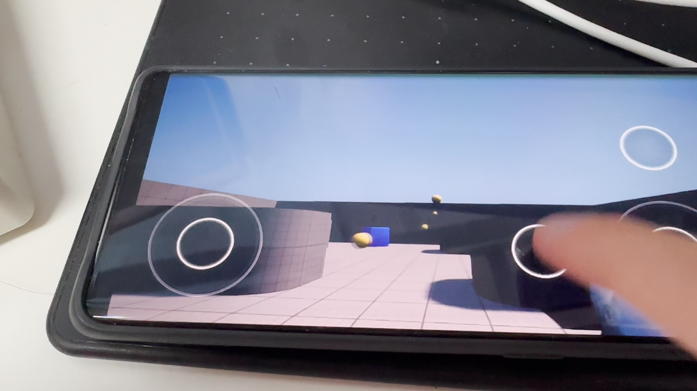
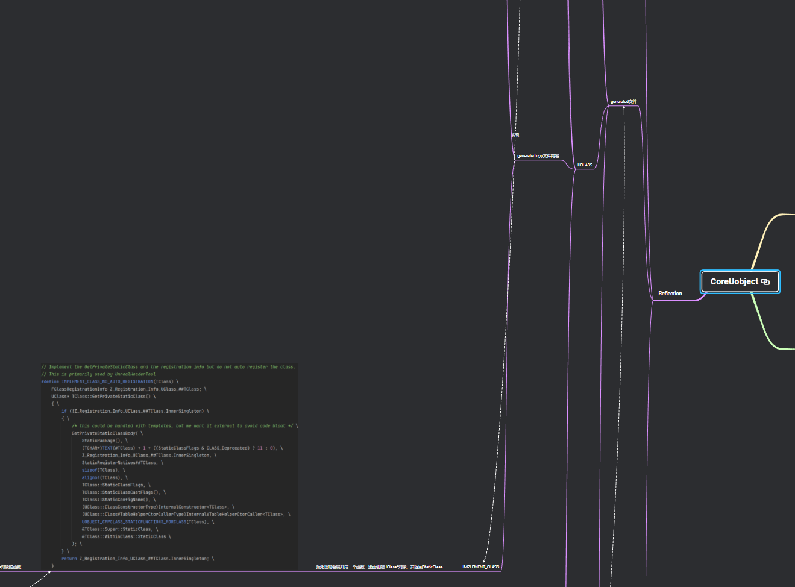
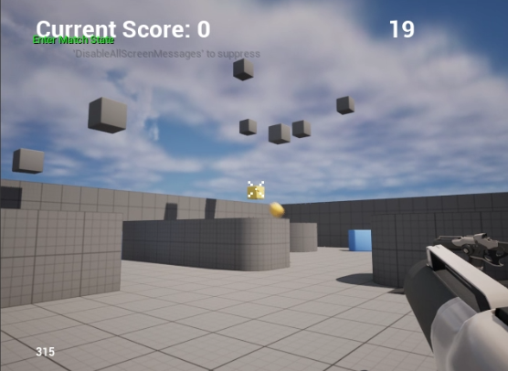
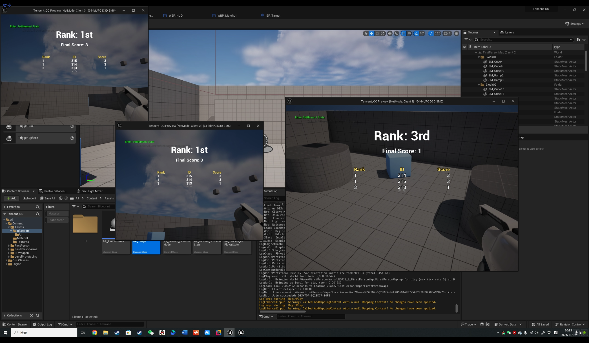
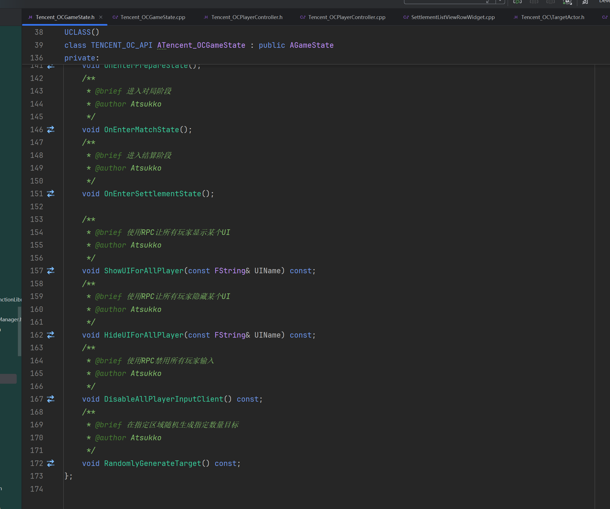

# Tencent Open Course
## Assignment
### 第一课
#### 1. UE5.3 源码版安装

 

&emsp;&emsp;报名公开课课前已经安装UE5.3.2源码版，并参与过腾讯图形学实践课，有一定的源码阅读、调试经验。 
 

#### 2. Android平台打包测试

 

&emsp;&emsp;使用源码引擎创建第一人称工程，完成Android环境配置并打包apk在安卓手机上成功运行，运行操作录像及手机录屏见[Video][Link1]
 

#### 3. 课堂笔记
&emsp;&emsp;整理了一个XMind脑图笔记，见[Note][Link2]，对老师上课讲的一些UE debug方法做了代码实现，对引擎工具进行了使用并整理了用法，将课上提到的一些内容链接到XMind中我之前做的学习笔记，例如UE的Gameplay架构，UE的反射原理，UObject序列化等(类似下图)。之后所有的笔记都整理在该文件中。

 

### 第二课
#### 1. 射击游戏demo
Demo演示视频见[Video][Link3]，简要说明如下
&emsp;&emsp;(1) 目标在指定包围盒区域内随机生成，普通目标值1分，有小概率生成高价值目标（金色材质），值2分，目标数量、目标分值、消灭目标需要的击中次数、高价值目标生成概率均可通过蓝图调整;
&emsp;&emsp;(2) 通过GameState控制对局流程，使用了简单的时间轴判断游戏阶段，如果游戏流程比较复杂可以使用有限状态机实现，我在其它项目有所实现。游戏流程分为准备阶段、对局阶段和结算阶段，各阶段时间均可通过蓝图设置，结算阶段玩家会失去控制权并进入慢动作模式;
&emsp;&emsp;(3) 实现了多人联机，在结算阶段通过一个ListView展示所有玩家排名、ID和分数，当出现分数相同玩家时，排名也会正确计算;
&emsp;&emsp;(4) 倒计时、分数、排名等数据通过UMG展示，使用Aseprite绘制了一个准星并应用在游戏中

 

 

&emsp;&emsp;(5) 核心代码文件见[source][Link4]，所有函数和属性的注释都写在头文件中

 

#### 2. 课堂笔记
见[Note][Link2]

[Link1]:Assignments/Assignment_01/videos
[Link2]:Note.xmind
[Link3]:Assignments/Assignment_02/videos
[Link4]:Assignments/Assignment_02/source
